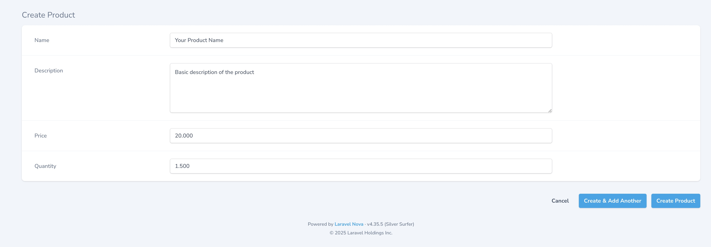
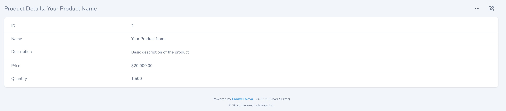

# Laravel Nova Numeric Mask Field

A Laravel Nova field that automatically adds thousand separator dots while typing. Perfect for currency, quantities, or any numeric input that needs better readability.



## Features
- Real-time thousand separator formatting (e.g., 1000 → 1.000)
- Works with copy/paste
- Maintains numeric value in database
- Compatible with Laravel Nova 4.x

## Requirements

- Laravel Nova 4.x or higher
- PHP 7.3 or higher

## Installation

You can install the package via composer:

```bash
composer require galangaidilakbar/numeric-mask
```

## Usage

```php
use Galangaidilakbar\NumericMask\NumericMask;

public function fields(Request $request)
{
    return [
        NumericMask::make('Price'),
    ];
}
```

That will give you separate dots while typing in the input field.

### Displaying the value

Since we store the raw value in the database, you can do whatever you want with the value. For example, you can use the `currency` method from Laravel's `Number` class:

```php
use Illuminate\Support\Number;
use Galangaidilakbar\NumericMask\NumericMask;

public function fields(Request $request)
{
    return [
        NumericMask::make("Price")->displayUsing(
            fn($value) => Number::currency($value)
        ),
    ];
}
```

That will display the value as a currency to be something like this: `$20,000.00`.



## Credits

- [Galang Aidil Akbar](https://github.com/galangaidilakbar)

## License

The MIT License (MIT). Please see [License File](LICENSE.md) for more information.
